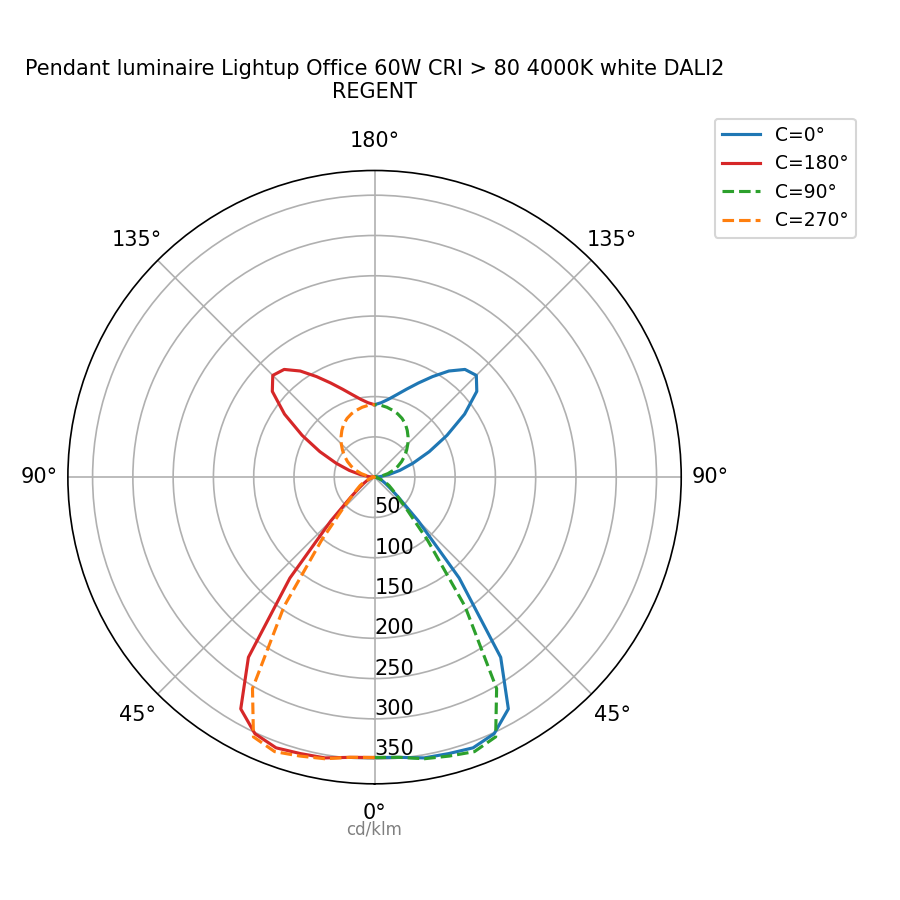

# pyldt — Plotting the polar intensity diagram

This example plots the four principal C-planes (C=0°, 90°, 180°, 270°)
as a polar intensity diagram.

Convention:
- γ=0° (nadir) at the bottom, γ=180° (zenith) at the top
- **C=0° and C=180°** — solid lines
- **C=90° and C=270°** — dashed lines
- C=0° and C=90° on the **right** half
- C=180° and C=270° on the **left** half
- Radial axis in **cd/klm**

The runnable script is [`02_polar_diagram.py`](02_polar_diagram.py).



---

## Dependencies

```
pip install matplotlib numpy
```

---

## Code

```python
import numpy as np
import matplotlib.pyplot as plt
from pyldt import LdtReader

# ── Load file ─────────────────────────────────────────────────────────────────
ldt = LdtReader.read("luminaire.ldt")
h = ldt.header

# ── Helper: extract one C-plane by angle ─────────────────────────────────────
def get_plane(target_angle: float) -> np.ndarray:
    """Return the intensity array (cd/klm) for the given C-plane angle (degrees)."""
    match = min(h.c_angles, key=lambda x: abs(x - target_angle))
    if abs(match - target_angle) > 0.1:
        raise ValueError(f"C-plane {target_angle}° not found (closest: {match}°)")
    idx = h.c_angles.index(match)
    return np.array(ldt.intensities[idx])

# ── Angular grid in radians ───────────────────────────────────────────────────
g_deg = np.array(h.g_angles)
g_rad = np.deg2rad(g_deg)

# ── Intensity data (cd/klm) ───────────────────────────────────────────────────
i_c0   = get_plane(0.0)
i_c90  = get_plane(90.0)
i_c180 = get_plane(180.0)
i_c270 = get_plane(270.0)

# ── Plot ──────────────────────────────────────────────────────────────────────
fig, ax = plt.subplots(subplot_kw={"projection": "polar"}, figsize=(6, 6))

# γ=0° at bottom, angles increase counter-clockwise
# → +g_rad (C=0° and C=90°)    lands on the RIGHT half
# → -g_rad (C=180° and C=270°) lands on the LEFT half
ax.set_theta_zero_location("S")
ax.set_theta_direction(1)

# C=0° and C=180° — solid lines
ax.plot( g_rad, i_c0,   color="#1f77b4", linewidth=1.5, linestyle="-",  label="C=0°")
ax.plot(-g_rad, i_c180, color="#d62728", linewidth=1.5, linestyle="-",  label="C=180°")

# C=90° and C=270° — dashed lines
ax.plot( g_rad, i_c90,  color="#2ca02c", linewidth=1.5, linestyle="--", label="C=90°")
ax.plot(-g_rad, i_c270, color="#ff7f0e", linewidth=1.5, linestyle="--", label="C=270°")

# Title and legend
ax.set_title(f"{h.luminaire_name}\n{h.company}", pad=16, fontsize=10)
ax.legend(loc="upper right", bbox_to_anchor=(1.3, 1.1), fontsize=9)

# Radial labels on the 0° axis (bottom), with unit
ax.set_rlabel_position(0)

# ax.yaxis.set_label_text() does not position correctly on polar axes
# → use ax.text() placed just beyond the outermost radial tick
r_max = ax.get_rmax()
ax.text(np.deg2rad(0), r_max * 1.15, "cd/klm",
        ha="center", va="center", fontsize=8, color="gray")

# Angular tick labels: γ values symmetric around the vertical axis
tick_angles_mpl = [0, 45, 90, 135, 180, 225, 270, 315]
tick_labels     = ["0°", "45°", "90°", "135°", "180°", "135°", "90°", "45°"]
ax.set_thetagrids(tick_angles_mpl, labels=tick_labels)

plt.tight_layout()
plt.savefig("polar_diagram.png", dpi=150)
plt.show()
```

---

## How it works

### Plane selection

`ldt.intensities` is already expanded to the full `[mc × ng]` matrix by
`LdtReader.read()` regardless of the file's ISYM value.
The helper `get_plane()` uses a nearest-match search on `h.c_angles` rather
than a strict `list.index()`, which avoids floating-point issues when angles
are stored with rounding.

### Plotting both halves of a plane pair

A standard polar intensity diagram places C=0° and C=180° on the same axis,
with C=0° on the right and C=180° on the left. The same applies to C=90°/C=270°.

The trick is to plot C=180° and C=270° with **negative angles**:

```python
ax.plot( g_rad, i_c0,   ...)   # right half  →  γ = 0° …  90°
ax.plot(-g_rad, i_c180, ...)   # left half   → -γ = 0° … -90°
```

### Orientation settings

| Setting | Value | Effect |
|---------|-------|--------|
| `set_theta_zero_location("S")` | South | γ=0° at the bottom |
| `set_theta_direction(1)` | Counter-clockwise | positive γ → right half |
| `set_rlabel_position(0)` | 0° (matplotlib) | radial tick values on the 0° axis |

Note: `set_rlabel_position` takes an angle in the **matplotlib native frame**,
not the displayed frame. With `zero_location="S"` and `direction=1`, passing
`0` places the tick values on the displayed 0° axis (bottom).

`ax.yaxis.set_label_text()` does not position correctly on polar axes — use
`ax.text()` with a polar coordinate instead to place the unit label.

### Angular tick labels

`set_thetagrids` replaces the default 0°–360° labels with γ values
(0°–180° symmetric around the vertical axis):

```python
tick_angles_mpl = [0, 45, 90, 135, 180, 225, 270, 315]
tick_labels     = ["0°", "45°", "90°", "135°", "180°", "135°", "90°", "45°"]
```

---

## Variant: rotationally symmetric luminaires (ISYM = 1)

For a fully symmetric luminaire all four planes are identical.
A single curve is sufficient:

```python
ax.plot(g_rad, i_c0, linewidth=1.5, label="C=0°")
```

## Variant: absolute candela

To plot in candela instead of cd/klm, multiply by the lamp flux:

```python
flux_klm = h.lamp_flux[0] / 1000.0
i_c0_cd = i_c0 * flux_klm
```
